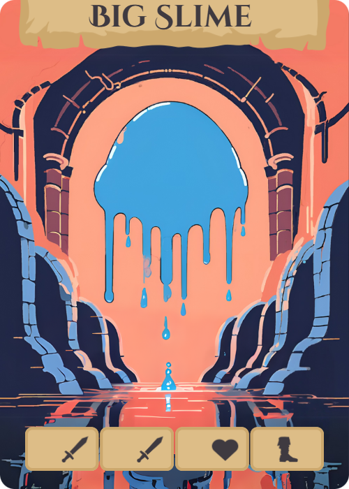
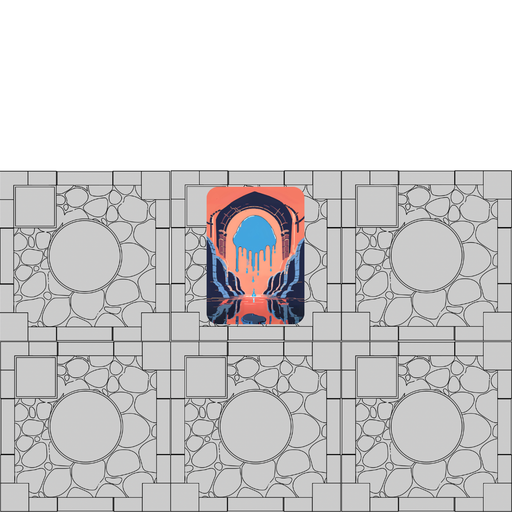

  

  <h2 style="margin-bottom: 12px; font-size: 1.5em;">Big Slime Gameplay Preview</h2>
  
  

    <iframe 
      src="https://www.youtube.com/embed/OWa-7d6t01c" 
      frameborder="0" 
      allow="accelerometer; autoplay; clipboard-write; encrypted-media; gyroscope; picture-in-picture" 
      allowfullscreen 
      style="position: absolute; top: 0; left: 0; width: 100%; height: 100%;">
    </iframe>
  

### **How to Play the Tutorial — Big Slime Boss** 

[YouTube Big Slime](

**Estimated Time: 30 minutes.** Recommended **only** if all players are new to the game, or if a player has never played a deck-builder before (Aeon's End, Clank!, Dominion, etc).

This tutorial introduces players to dungeon mechanics, encounters, and boss battles. Follow the [Base Set Up](http://127.0.0.1:8000/base-setup.html) first, then proceed below.

### **Tiles**
- Place the Portal Tile in the center of the table.

- Remove the Boss Tile and set it aside.

- Shuffle the remaining 4 dungeon tiles and place them face down around the Portal Tile.

- Finally, add the Boss Tile to the play area as the last tile to be discovered.

### **Minions**
Create two piles:

- Minions Level 3–6

- All remaining minions

- Shuffle each pile separately and place them face down.

- Draw 1 Slime per player from the Level 3–6 pile and place them on top of the other minion pile.

- Return the unused Level 3–6 pile to the box.

### **Objective**
Players have 10 turns to explore the dungeon, find the Big Slime, and defeat it.

**Win Condition:** Defeat the Big Slime within 10 turns.

**Lose Conditions:**

- Any player drops to 0 HP.

- More than 10 turns are required to defeat the Big Slime.

### **Turn Structure**
- All players act simultaneously during each turn.

- Each player uses 5 cards per turn.

- Wait until all players finish their turn before starting the next one.

*For more information about actions, encounters, or buying, see the relevant sections earlier in the rulebook.*

### **Entering the Big Slime Boss Room**
Once discovered, the Boss Room Tile requires 1 boot; action to enter. Upon entering, flip over the Boss Room tiles and arrange them into a 2x3 grid, as pictured below. 

  

### **Big Slime Mechanics**
- At the start of each turn (including the turn you enter), roll a D6 to determine where the Big Slime bounces.

- The tile the Slime lands on takes 3 damage per player.

- Adjacent tiles take 1 damage per player.

- The Big Slime has 10 HP per player.

**Players must be on the same tile as the Big Slime to deal damage to it.**

*Movement in the Boss Room works just like the dungeon: 1 boot; action = 1 tile of movement*
