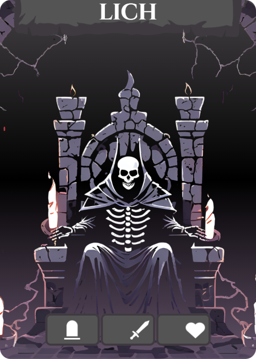

  

### **The Lich Set Up:**

Follow [Base Set Up](/Rulebook/base-setup.html), then proceed here.
*Please note this boss uses tombstone tile corners and comes with its own unique tiles.*

- [**Event Deck:**](/Rulebook/bosses/lich/lich.html#event-types) Shuffle the event deck and place it in the play area. The event deck has 20 cards (1 for each turn) and will always be drawn as the first action of each turn. These events will trigger immediately, and automatically resolve at the end of the turn unless otherwise noted.

- [**Boss Tracker:**](/Rulebook/bosses/lich/lich.html#boss-tracker) Arrange the Boss Tracker on the side of the play area. The tracker starts with 0 and ends with 10. Use a tombstone card tombstone; to move along the tracker. Start at 0.

trackerblank;50 litchdrain;50 trackerblank;50 beckoning;50 trackerblank;50 reapersstride;50 trackerblank;50 greatrevival;50 trackerblank;50 withering;50 rip;50 

- **Minion Deck:** 

&nbsp;&nbsp; - All [Death Riders]( and [Shamans]( should be placed to the side. 

&nbsp;&nbsp; - Separate the level 5&6 minions from the rest. 

&nbsp;&nbsp; - Shuffle both piles and place them face down.
 
&nbsp;&nbsp; - Take the 5&6 pile and draw 2 minions per player (2 players, 4 minions, etc). 

&nbsp;&nbsp; - Place these minions on top of the other minion pile. 

&nbsp;&nbsp; - Discard the rest of the level 5&6 minions. 

*The level of minions will be indicated in the top left corner of each minion card.*

## **Death Rider**

### **Abilities**
Death Riders are unlike other minions of the Lich. Death Riders are the sentries who move around the dungeon and have the obscene ability to end its foes with a single scratch (deathtouch).

### **Death Rider Main Card:**
Once in the card sleeve, use the dry erase marker to write the values on the Death Rider card, as found in the table → 

  

| Players | sword;   |   shield; |  Health;  |
|---------|:--------:|:---------:|:---------:|
| 1       |    4     |     2     |     1     |
| 2       |    5     |     3     |     2     | 
| 3       |    6     |     4     |     3     | 
| 4       |    7     |     5     |     4     | 

&nbsp;&nbsp;&nbsp;&nbsp;

## **Shaman** 

### **Abilities** 
The shaman is a loyal minion to the lich, helping to channel the Lich's power. Each turn the Shaman will succeed in increasing the Lich's power, making the dungeon more overwhelming to adventurers.

### **Shaman Main Card**

  

| Players | sword;   |   Health; |
|---------|:--------:|:---------:|
| 1       |    2     |     1     | 
| 2       |    4     |     2     |
| 3       |    6     |     3     | 
| 4       |    8     |     4     | 

&nbsp;&nbsp;&nbsp;&nbsp;

Same as the Death Rider, take the main shaman card, place it in a sleeve protector and use the expo marker to write the correct values (2 swords per player, and 1 heart per player).

## **Tombstones:** 
Upon discovery, increase the Boss Tracker by 1. The Boss Tracker may be decreased by players while on a tile with a tombstone. See [Decreasing the Tracker](

## **Game Play:**

### **About the Lich:**

The Lich sits on his throne deep within the dungeon. Players must find him and defeat him in 20 turns, and he will do whatever he can to stop them. Through various minions and mini bosses he aims to keep the players occupied in the dungeon until they run out of time. As he channels his power, the dungeon will get increasingly harder. Every four turns, and each turn in the boss room he will unleash his power, and various effects on players will occur. Don’t let him get too powerful, or the game will end.

### **Lose Conditions:** 
- Any member of the party is killed off.
- Any damage from a Death Rider is left unblocked.
- The Boss Tracker reaches 10.
- Players run out of turns (more than 20).

### **Win Conditions:**
- Players defeat the boss in the allotted 20 turns.

## **Starting a Turn:**
Each turn will begin with players revealing an event card from the deck. All events revealed take place immediately before players begin their turn. All events will resolve at the end of the player's turn, except as indicated on the event card. For an easy way of tracking your turns/unleashing, we suggest laying event cards down in piles of 4.
	
### **Turn Order**
- Event Card
- Unleash (every 4 turns)
- Players use actions and buy
- Resolve end-of-turn actions (moving Death Riders, increasing tracker, life drain, etc)

## **Event Types:**

  

**Grip of the Grave:**  Skeletal hands burst up out of the floor aiming to hold you down and make you become one with the dungeon. Players evade Grip of the Grave using a wild; action, either stored, or made with actions from their hand. If players do not have a wild; to evade, they are held down and lose all turns until they are recovered. 

**Players may be recovered 1 of 2 ways:** 

**1)** an escaped player may use 1 sword per player to help others escape
**2)** a player may lose all health but 1 to free themself.
### Grip of the Grave {.toc-only}

  

**Bone Upheaval:**  The dungeon terrain becomes more difficult to traverse, with sharp bone splinters spiking outwards. This turn requires 2 boot; to move one room. Players may choose to move with one boot; per room, losing 3 heart; per room entered. **The tracker will increase by 1 for each Death Rider in the Dungeon or Boss Room.**
### Bone Upheaval {.toc-only}

  

**Skeleton Surge:**  The Lich’s power boosts his minions, giving them extra strength this turn. All attacking minions gain 2 additional damage. At the end of the turn the tracker will increase by 1 for each player with 5 health or less.

### Skeleton Surge {.toc-only}

&nbsp;&nbsp;&nbsp;&nbsp;

  

**Shaman:**  A dedicated minion of the Lich, the Shaman will keep the tracker increasing by 1 at the end of each turn until defeated. The Shaman spawns at a tombstone, automatically increasing the tracker by 1. If there is more than 1 tombstone, use a dice to determine which one it will spawn at.

### Shaman {.toc-only}

  

**Reaper's Stride:**  The tracker increases 1. All Death Riders gain swiftness, increasing their movement by 1 this turn (this action is stackable with the tracker).

### Reaper's Stride Event {.toc-only}

&nbsp;&nbsp;&nbsp;&nbsp;

  

**Domain:**  A series of unfortunate events, the tracker will increase by 1. The tracker will also increase by 1 for each player that has 5 health or less. The tracker will also increase by 1 for each Death Rider in the Dungeon or Boss Room.

### Domain {.toc-only}

&nbsp;&nbsp;&nbsp;&nbsp;

## **Boss Tracker:** 

### **Decreasing the Tracker:** 
Players may decrease the tracker while at any tombstone. The amount of actions required to bring the tracker down is 2 per player. In a two-player game 4 actions are required to reduce the tracker by 1. Actions may come from one player or as a combination between the two players, but each contributing player must be at a tombstone tile corner.

### **Unleash Actions:**
Every 4 turns, and every turn in the Boss Room, the Lich’s tracker will “unleash.” This means that wherever the marker is on the tracker, all events at that point and before it will be triggered. For instance, if the tracker is at 6 during “unleash”, all players would suffer Lich’s Drain, Beckoning, and Reaper’s Stride. Unleash actions happen immediately after the event deck has been drawn.

&nbsp;&nbsp;&nbsp;&nbsp;

*All Effects Will Resolve at the End of the Turn Unless Otherwise Noted*

 

  

&nbsp;&nbsp;&nbsp;&nbsp;

**Lich's Drain:**  All players lose 2 actions at the beginning of the turn.
### Lich's Drain {.toc-only}

&nbsp;&nbsp;&nbsp;&nbsp;

&nbsp;&nbsp;&nbsp;&nbsp;
 

  

&nbsp;&nbsp;&nbsp;&nbsp;

**Beckoning:**  A Death Rider spawns at the portal in the dungeon or at a tombstone in the Boss Room.
### Beckoning {.toc-only}

&nbsp;&nbsp;&nbsp;&nbsp;

&nbsp;&nbsp;&nbsp;&nbsp;
 

  

&nbsp;&nbsp;&nbsp;&nbsp;

**Reaper's Stride:**  All Death Riders gain 1 extra movement this turn. If Reaper’s Stride is drawn as the event card, and as part of Unleash, Death Riders will gain 2 extra movement instead.
### Reaper's Stride {.toc-only}

&nbsp;&nbsp;&nbsp;&nbsp;

&nbsp;&nbsp;&nbsp;&nbsp;
 

  

&nbsp;&nbsp;&nbsp;&nbsp;

**Great Revival:**  A Wraith will spawn at a tombstone, as indicated by a dice (if there is more than 1 tombstone). More than one Wraith may be spawned at a time.
### Great Revival {.toc-only}

&nbsp;&nbsp;&nbsp;&nbsp;

  

&nbsp;&nbsp;&nbsp;&nbsp;

**Withering:**  Player’s max hp is permanently decreased to 5. All health above 5 is lost and cannot be recovered.
### Withering {.toc-only}

&nbsp;&nbsp;&nbsp;&nbsp;

&nbsp;&nbsp;&nbsp;&nbsp;
 

  

&nbsp;&nbsp;&nbsp;&nbsp;

**RIP:**  The Lich overpowers all players and the quest is lost.
### RIP {.toc-only}

&nbsp;&nbsp;&nbsp;&nbsp;

## **Mini Boss: The Wraith**

  

| Players | Health; |
|---------|:-------:|
| 1       |    6    |
| 2       |   12    |
| 3       |   18    |
| 4       |   24    |

&nbsp;&nbsp;&nbsp;&nbsp;

### **Wraith Actions**
- The Wraith will spawn at a tombstone, just like the Shaman. Players will roll to indicate which tombstone if there is more than one.
- The Wraith deals 1 damage to each player, individually. Players must block their own damage, or take it directly to their health.
- The Wraith increases the tracker at the end of each turn.
- The Wraith takes 2 health from each player at the end of each turn.

### **Winning**
Upon defeating him, decrease the tracker 1 and players receive one loot card each.

## Lich Boss Encounter:

clitch;300

| Players | sword;   |   Health; |
|---------|:--------:|:---------:|
| 1       |    2     |     15    | 
| 2       |    4     |     30    |
| 3       |    6     |     45    | 
| 4       |    8     |     60    | 

### **Room Setup** 
Flip over 10 tiles and arrange them as so, with the Lich in the center of the room → 

  

### **Boss Tracker** 
Upon entering the room, the tracker increases by 3 immediately. The Boss Tracker will Unleash each turn in the Boss Room. If Unleash has already occurred on the turn you enter the Boss Room, the tracker will only increase by 3, waiting to Unleash until the start of next turn. The Lich does not move and has a set amount of health and damage, scalable to the playes (only to be dealt when you are on his tile).

### **Tombstones:**
**Spawning:** Roll a D4 each time something is spawned into the room. The number will indicate which tombstone the creature will spawn at. 
**Lowering Tracker:** Players may continue to use tombstones as locations to bring down the Boss Tracker.

### **Movement:** 
Players must have 1 boot per movement in the room. Players cannot move when a Death Rider is on their tile, without defeating them. Death Riders move one tile per turn, towards the Lich unless they are occupied by a player.

### **Defeating the Lich:**
Players must be on the Lich’s tile to deal damage to him.
